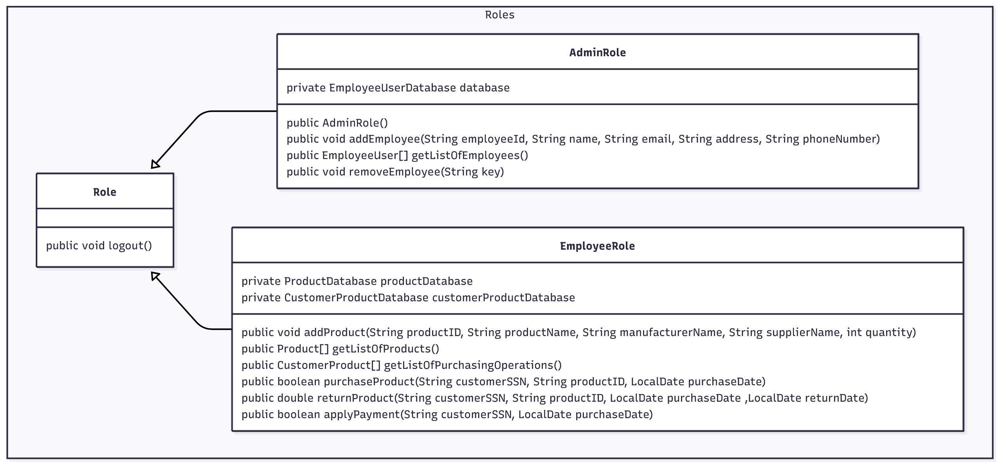
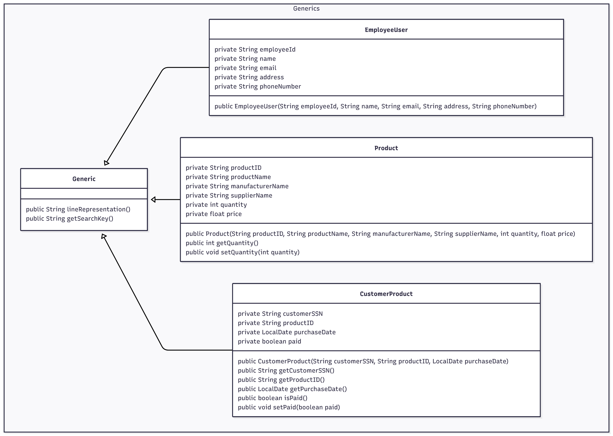

## Inventory Management System

### Table of Content

- [Assignment](#assignment)
- [Team Members](#team)
- [Relationship Diagrams](#relationships-between-classes)

### Assignment
The requirements requested by the TAs has be listed in this [pdf](https://drive.google.com/file/d/1awe83TCHXbYR8EHDjyO0JQvU9HI3k-Sn/view?usp=drive_link).

Refer to it to check the completion of this project.

### Team
- [Andrew Sameh Adel Mikhail](https://github.com/acskii) - ID **9489**
    
  - Repository Owner & Merger
  - Interfaces & Abstract Classes
  - EmployeeUser & EmployeeUserDatabase Classes
  - AdminRole Class
  
- [Abdoalrahman Khedr](https://github.com/Abdoalrahmankhedr) - ID **9624**

    - GenericDatabase idea + implementing w/Andrew
    - Product & ProductDatabase Classes
  
- [Hassan Mohsen](https://github.com/Hassanmo-20) - ID **9635**
    
    - CustomerProduct & CustomerProductDatabase
  
- [Ahmed Sherif](https://github.com/ahmed-sherif-hassona) - ID **9631**
    
    - EmployeeRole Class

### Summary
A product management system with employee and customer functionality. Employees manage products and handle purchases/returns. Customers can buy products, return within 14 days, and make payments. The databases maintains product inventory, tracks customer purchases, and manages payment status through file-based persistence.

### Diagrams
#### Relationships between classes

- Relationships between all classes derived from the **Database** interface

- Relationships between all classes derived from the **Role** interface

- Relationships between all classes derived from the **Generic** interface
